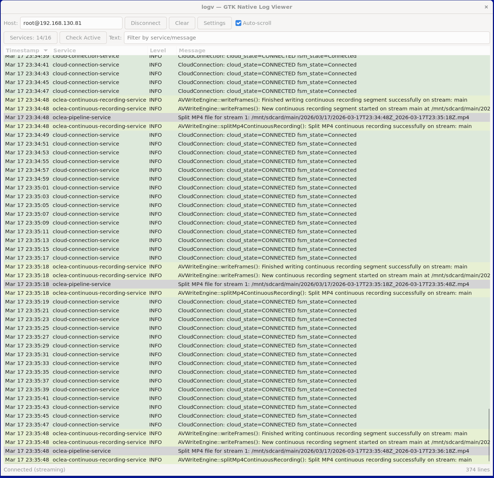

# logv - Device Log Viewer



Streams and filters `journalctl` output from embedded Linux devices.
Two interfaces share the same C++ log parser (`logvcore`):

| Variant | Where |
|---|---|
| **GTK3 desktop app** | `gtk_native/build/logv-gtk` |
| **Web viewer** (single `.html` file) | `wasm/dist/logv.html` |

---

## Web Viewer

A self-contained ~130 KB HTML file.  Open it directly in any browser - no web
server required.

### Quick start - one command

```bash
bash run-wasm.sh root@<device-ip>
```

This single script does everything:
1. Checks SSH connectivity to the device
2. Compares the local proxy version (git hash) against the one on the device -
   copies `logv-proxy.py` only when it has changed
3. Restarts the proxy on the device
4. Opens `logv.html` in your browser with the IP pre-filled - just click **Connect**

Works on **WSL**, native Linux, and macOS.

```bash
# Custom port (default: 9222)
bash run-wasm.sh root@192.168.130.81 9222
```

### Manual start (without run-wasm.sh)

**Step 1 - start the proxy on the device:**

```bash
# Copy once
scp logv-proxy.py root@<device-ip>:

# Start it (Ctrl+C to stop)
ssh root@<device-ip> python3 logv-proxy.py
```

> `logv-proxy.py` has **zero external dependencies**.  It uses only Python
> builtins compiled into the interpreter itself (`os`, `sys`, `struct`,
> `subprocess`, `threading`) - no `pip install`, no Yocto packages needed.
>
> Networking is handled by **BusyBox `nc`** (always present on embedded Linux).
> The proxy calls `nc -lk -e python3 logv-proxy.py`, which re-executes the
> script for each browser connection with stdin/stdout wired to the TCP socket.
> WebSocket framing, the SHA-1 handshake, and the base64 accept-key are all
> implemented in pure Python inside the script.
>
> It opens a WebSocket server on port **9222**, launches `journalctl -f`
> and streams every line back to the browser.

**Step 2 - open the viewer:**

1. Open `wasm/dist/logv.html` in Chrome / Firefox / Edge.
2. Enter the device IP in the **Host** field (port default: **9222**).
3. Click **Connect**.

### Build the viewer

```bash
# First run - auto-installs emsdk, then builds
bash build-wasm.sh --install

# Subsequent builds (emsdk already present)
bash build-wasm.sh
```

Output: `wasm/dist/logv.html` (single self-contained file).

### Proxy options

```
python3 logv-proxy.py [port]    (default port: 9222)
```

The browser sends the remote command as JSON on connect:
```json
{ "cmd": "journalctl -f --no-pager -o short-precise 2>&1 | cat" }
```
This can be changed in the viewer's **Settings** dialog.

### Features

- Live log streaming via WebSocket proxy
- Open a saved log file (drag & drop or "Open File")
- Paste journalctl output directly into the viewer
- Service filter, level filter, text filter (same as GTK3 app)
- Color-coded rows by service / level
- Multi-select rows → Ctrl+C or right-click → Copy
- Auto-scroll, auto-reconnect on connection drop
- Settings: remote command, port, max lines
- Config persisted to `localStorage`
- Virtual scroll - smooth at 50 000+ lines
- WASM C++ parser (same `logvcore`) with pure-JS fallback while WASM loads

---

## GTK3 Desktop App

### Architecture

```
SSH subprocess (fork/exec)
    │  raw lines via fd
    ▼
Reader thread            ← parses lines into LogEntry, pushes to pending deque
    │
GLib timer (100 ms)      ← drain_pending() - incremental insert into GtkListStore
    │
Service / Level filter   ← per-checkbox, per-level, case-insensitive text
    │
GtkTreeView
```

The C++ parser (`logvcore/src/log_parser.cpp`) is a standalone library -
no Python, no regex.

### Features

- **SSH streaming** - `journalctl -f --no-pager -o short-precise` (or custom command)
- **Multi-service filter** - check/uncheck services; unknown services auto-discovered per host
- **Log level filter** - DEBUG / INFO / WARNING / ERROR / CRITICAL
- **Text filter** - live case-insensitive substring search
- **Per-service pastel row colors** + level-based highlight
- **Microsecond-precision timestamps** with asc/desc sort
- **Auto-scroll** toggle
- **SSH keep-alive** - configurable `ServerAliveInterval`; auto-reconnect on drop
- **Service diagnostics** - "Check Active" runs `systemctl is-active` over SSH
- **Configurable log buffer** - max lines in memory (0 = unlimited)
- **Per-host service discovery** - clears discovered services on host change
- **Persistent config** - `~/.config/logv/config.json`

### Requirements

```bash
sudo apt install libgtk-3-dev libjsoncpp-dev cmake build-essential
```

### Build & run

```bash
bash build-gtk.sh
bash run-gtk.sh
# or: ./gtk_native/build/logv-gtk
```

### Settings dialog

| Tab | Options |
|---|---|
| SSH | Host, Username, Port, Keep-alive, Auto-reconnect, Remote command |
| Services | Newline-separated list of service names |
| Log Levels | Per-level visibility |
| General | Max log lines |

### Config file

`~/.config/logv/config.json`

| Field | Default | Description |
|---|---|---|
| `connections.ssh.host` | `192.168.130.81` | SSH target |
| `connections.ssh.username` | `root` | SSH user |
| `connections.ssh.command` | `journalctl -f --no-pager -o short-precise 2>&1 \| cat` | Remote command |
| `connections.ssh.keepalive` | `30` | ServerAliveInterval (s) |
| `connections.ssh.auto_reconnect` | `true` | Reconnect on drop |
| `max_lines` | `50000` | Max lines in buffer (0 = unlimited) |
| `auto_scroll` | `true` | Auto-scroll to newest |
| `newest_at_bottom` | `true` | Sort direction |

### Log format

```
Mar 17 12:00:00.123456 hostname service-name[pid]: [LEVEL](tid=N) message
```

- Fractional (microsecond) timestamps
- `<N>` kernel priority prefix stripped
- `WARN` normalised to `WARNING`
- Unstructured lines shown as-is in the Message column
